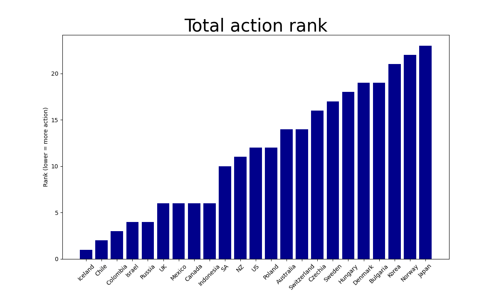

# 2008-Financial-Crisis-Response

This notebook visualizes responses to the 2008 financial crisis in terms of interest rate cuts and money supply hikes from 2008-2011 among OECD members. The results show that Iceland took the most agressive action during this period. 

- The notebook used to access the OECD API can be found [here.](oecd_api_.ipynb)
- The SQL script used to manipulate the data can be found [here.](responses.sql)
- The data visualization notebook can be found [here.](visualize_data.ipynb)

 

 

This visualization includes the following statistics obtained from the OECD API and manipulated with SQL:

- Total action rank (based on interest cut rank + money supply hike rank)
- Interest rate cut rank (based on deepest interest rate cut)
- Deepest interest rate cut (from the 2003-2007 average to the minimum interest between 2008 and 2011)
- Average interest rate from 2003-2007
- Minimum interest rate from 2008-2011
- Money supply hike rank (based on largest money supply hike)
- Largest money supply hike (from the 2003-2007 average to the minimum money supply between 2008 and 2011)
- Average money supply from 2003-2007
- Minimum money supply from 2008-2011
